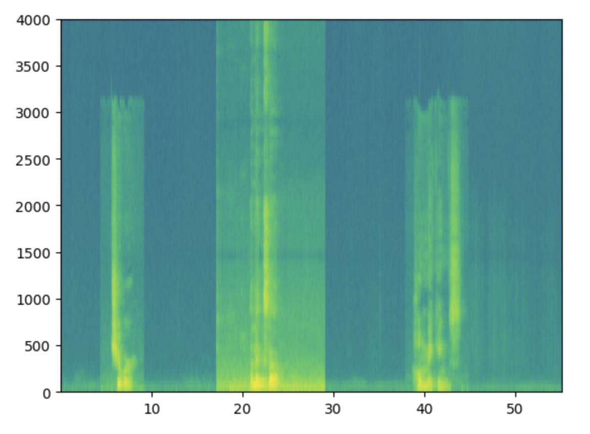
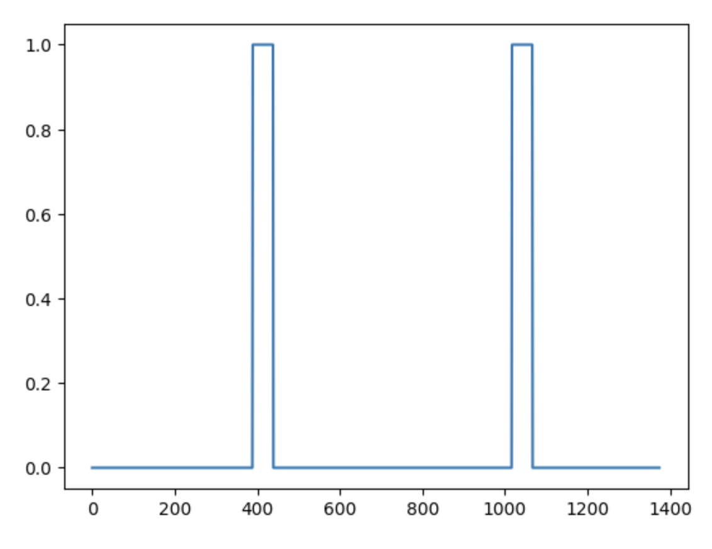

# Trigger Word Detection

## Overview

This project focuses on replicating a trigger word detection system using audio data, specifically through the analysis of spectrograms.

A spectrogram is a visual representation of the spectrum of frequencies in a signal as it varies with time. It is used to analyze and interpret the frequency content of audio signals.

The model is expected to identify patterns associated with trigger words by analyzing these spectrograms.

## Workflow

- **Manual Data Collection**: Collecting and preparing various audio samples for model training and evaluation. They samples are categorized into positive triggers ('alexa'), negative sounds (irrelevant background noise), and neutral background segments.
- **Data Processing**: The collected audio files were preprocessed to ensure consistency. This includes resampling audio to a standard rate, verifying and trimming file durations, and creating a uniform format for input to the model. Background audio segments are combined with trigger and noise samples to create training examples.
- **Model Training**: Implementing a deep learning model using a sequence-based approach.
- **Handling Imbalanced Data**: Applying weighted binary cross-entropy to address class imbalance and preventing overfitting.

## Objectives

- Develop a system to detect specific keywords or phrases in audio signals.
- Utilize sequence models to enhance the detection accuracy.

## References

This code is based on the assignment **'Trigger Word Detection'** from the **Sequence Models** course, which is part of the **Deep Learning Specialization**.
